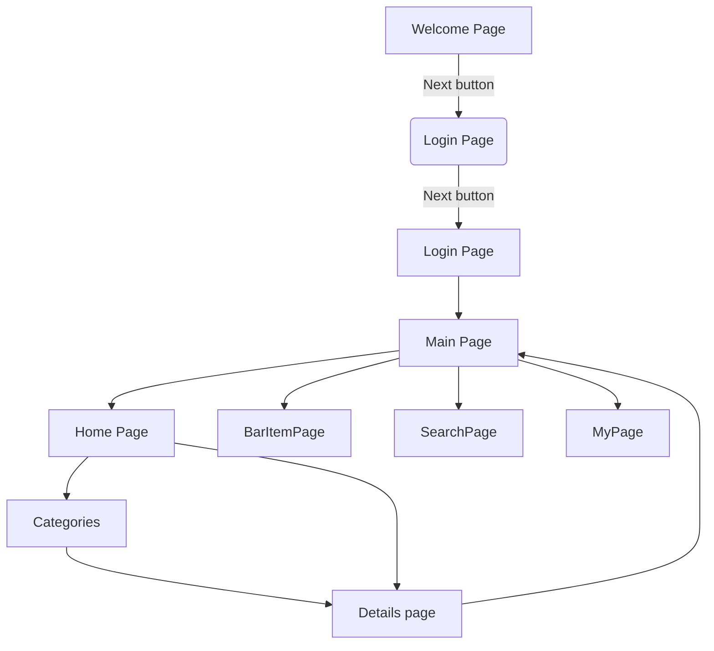

# recipes_app
 
### Usage

for debugging use Iphone SE
``flutter run``

```mermaid
graph TD
    A[Welcome Page] -->|Next button| B(Login Page)
    B --> |Next button| C[Login Page]
    C --> D[Main Page]
    D --> E[Home Page]
    D --> F[BarItemPage]
    D --> G[SearchPage]
    D --> H[MyPage]
    E --> E1[Categories]
    E1 --> E2[Details page]
    E2 --> D
    E --> E2
```